# UK Hikes

## Overview

**UK Hikes** is a community platform for outdoor enthusiasts to share, discover, and discuss their hiking experiences. It connects hikers by providing a space to exchange tips, recommend trails, and share real adventures. The site works seamlessly on desktops, tablets, and mobiles, keeping you connected wherever you are.


For project planning, see: [Project Planning](planning.md)  
For project testing, see: [Project Testing](testing.md)

---

## Features

### Core Features

1. **User Registration & Authentication**  
   Users can sign up, log in, and manage their profiles using **Django-Allauth**.

2. **Blog Posts & Comments**  
   Users can create, edit, and delete posts that include rich text and images. They can also comment on posts to share their hiking experiences.

3. **Testimonials**  
   Hikers can submit testimonials about their adventures. Submitted testimonials are reviewed and approved by admins to ensure quality content.

4. **Profile Management**  
   Users can update their personal details and view a consolidated page of their posts and activity.

5. **Responsive Design**  
   The application is fully responsive, providing a seamless experience on desktops, tablets, and mobile devices.

### Future Features

- **Location and Difficulty Filtering:**  
  Originally outlined in the user stories, this feature to filter and sort posts by location and difficulty is planned for future development.

- **Hike Rating:**  
  A rating system for each hike, also part of the initial user stories, will be implemented in future updates.

- **Upvote/Downvote System:**  
  Initially part of the user stories, this feature—allowing users to upvote or downvote posts to highlight useful content—will be implemented in future updates.

- **User Profile Enhancements:**  
  - Display the username and profile picture on posts.
  - Link to user profiles and include a follow button for updates.


---


## Color Scheme

## Color Scheme

The color palette used in **UK Hikes** has been carefully chosen to create a clean, modern look while emphasizing usability and accessibility. The colors are defined in the project's **CSS**, ensuring consistency across the application. Here’s a breakdown of the key colors:

- **Background:**  
  The overall background of the site is set to `#f8f9fa`, a light, neutral tone that provides a clean canvas for content.

- **Primary Buttons and Actions:**  
  Main buttons, including the primary, success, and logout buttons, use a vibrant **dark green**: `#146c43`.  
  Their borders are set to `#146c43`, ensuring consistency in the button design.

- **Footer:**  
  The footer has a **dark gray** background of `#343a40` with **white** text, creating a strong contrast for readability.

- **Social Media Icons:**  
  Social media icons are displayed in **white** by default, and when hovered over, they change to a bright **yellow** (`#ffcc00`), adding a pop of color.

- **Typography:**  
  **Headings** in the welcome section use a **dark gray** (`#333`), while **paragraph text** is a softer gray (`#555`), ensuring that text is both legible and aesthetically pleasing.

- **Cards and Post Elements:**  
  Card text utilizes a **medium gray** (`#6c757d`) for a balanced, subtle look.

- **Pagination and Navigation:**  
  Pagination buttons use the **dark green** (`#146c43`) for their background, providing a consistent color throughout the site. The text is **white**.

- **Back Button:**  
  The **back button** follows the same **green** theme as the primary buttons, using `#146c43` for the background and `#146c43` for the border, reinforcing a cohesive visual style.


---


## Input Validation

The site checks that data is correct to help avoid mistakes:

- **User Registration:**  
  Prevents empty or invalid email addresses and weak passwords.

- **Post Creation:**  
  Requires that all fields (title, content, images) are filled out before a post can be submitted.

- **Commenting:**  
  Ensures that comments are not empty and meet minimum length requirements.

- **Testimonial Submission:**  
  Requires that testimonial content and proper formatting are provided, and submissions are sent to an admin for approval.

- **Log In:**  
  Verifies credentials and provides immediate feedback if the required information is missing or incorrect.

---

## How the Site Works

- **User Registration & Authentication:**  
  Users sign up and log in to access all the features. The registration and log in pages offer clear error messages so you know exactly what to fix.

- **Blog Posts & Comments:**  
  Once logged in, you can write and publish posts with text and images. Each post has a detail view for reading and commenting, and the comment forms provide instant feedback.

- **Testimonials:**  
  Users can share their hiking experiences as testimonials. An admin checks these before they’re shown publicly, so only good quality content appears.

- **Profile Management:**  
  You can update or delete your profile to manage your personal details.

- **Responsive Design:**  
  The layout adjusts smoothly to any screen size, making the site easy to use on any device.

---

## Screenshots

- **Home Screen**  
  *The main landing page for the site.*  
  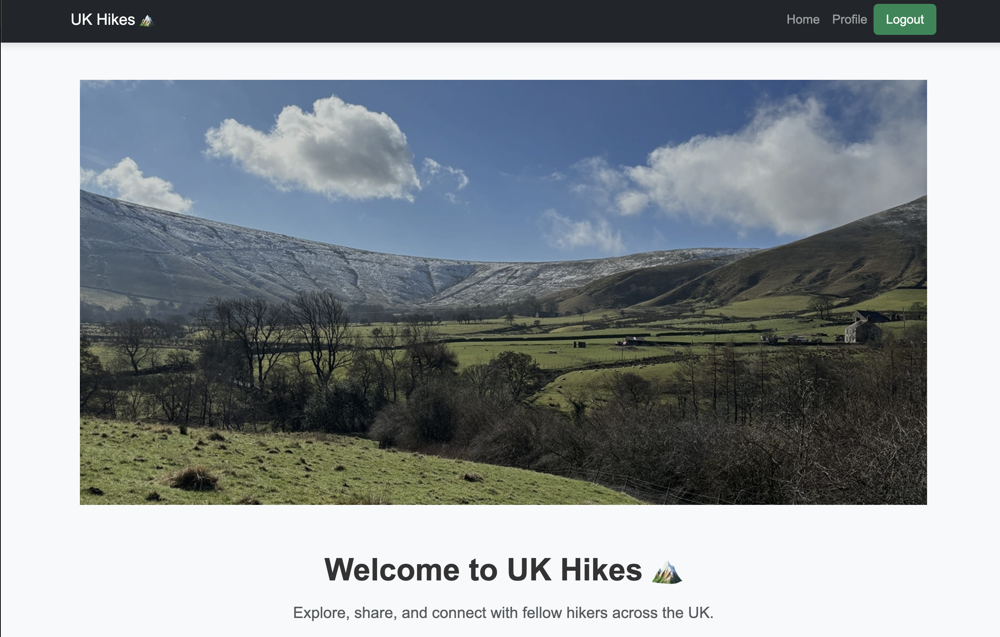  
  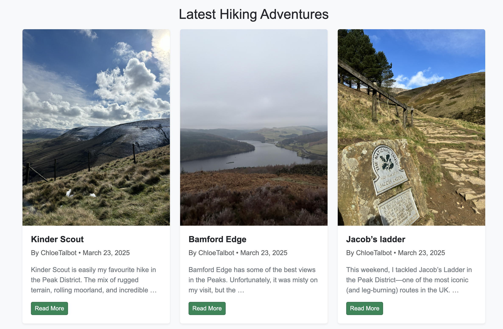
  *The homepage features recent posts and invites exploration.*

- **Footer**  
  *Shows the website footer with navigation links.*  
    
  *Quick navigation and site details are always at hand.*

### 1. User Registration & Authentication

- **Create Account**  
  *A screenshot of the user registration page.*  
  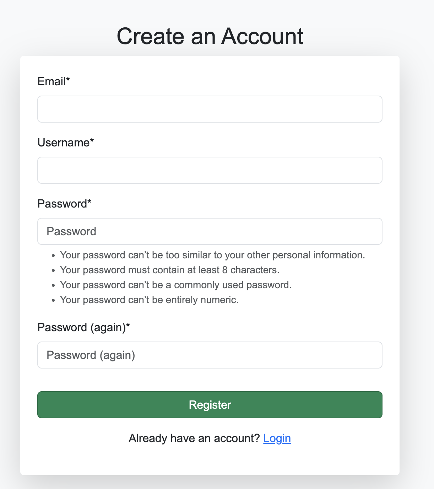  
  *New users sign up through a simple page with clear instructions.*

- **Log In**  
  *Screenshot of the log in page.*  
  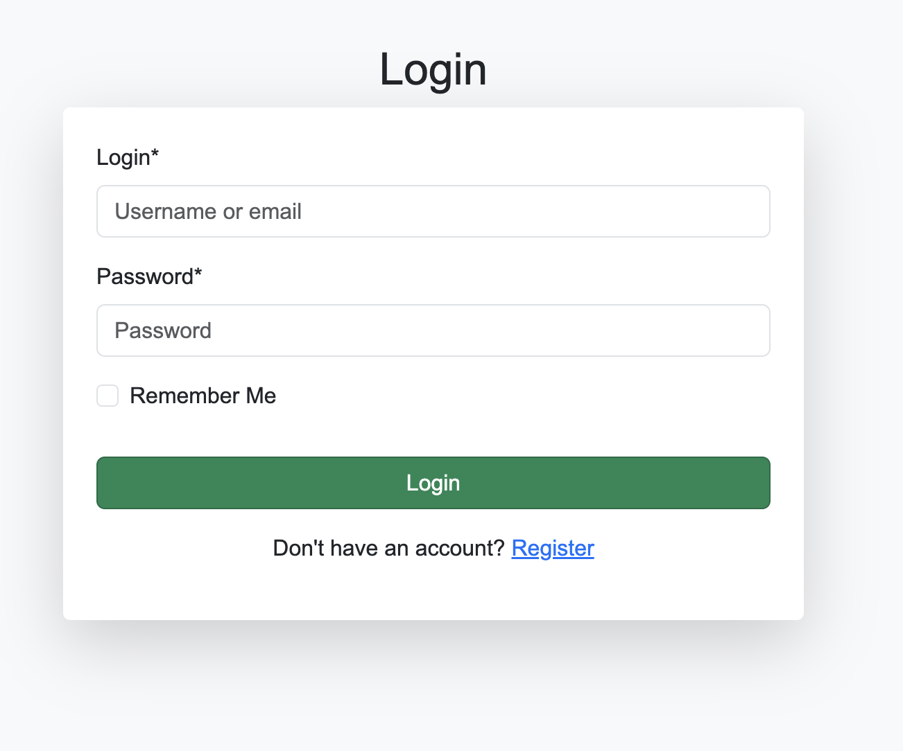  
  *The secure log in page provides quick validation feedback.*

- **Log Out**  
  *Shows a message after logging out.*  
  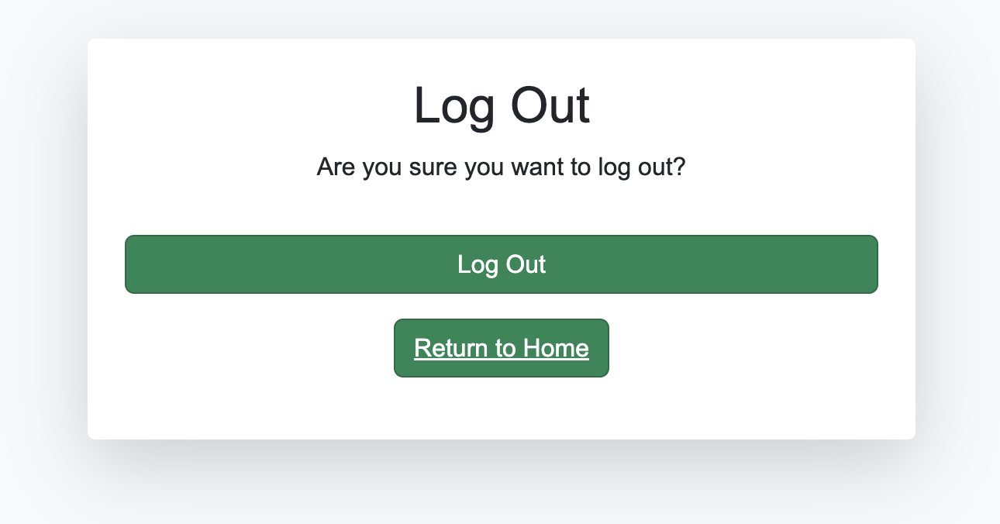  
  *After logging out, users get a clear confirmation.*

- **Sign In Validation**  
  *Validation messages during log in.*  
  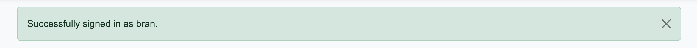
  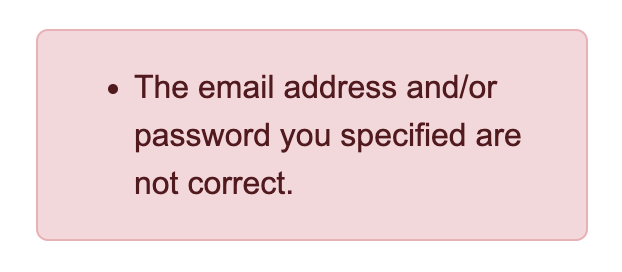  
  *Helps users correct mistakes during log in.*

---

### 2. Blog Posts & Comments

- **Create Post**  
  *How users can write a new post.*  
  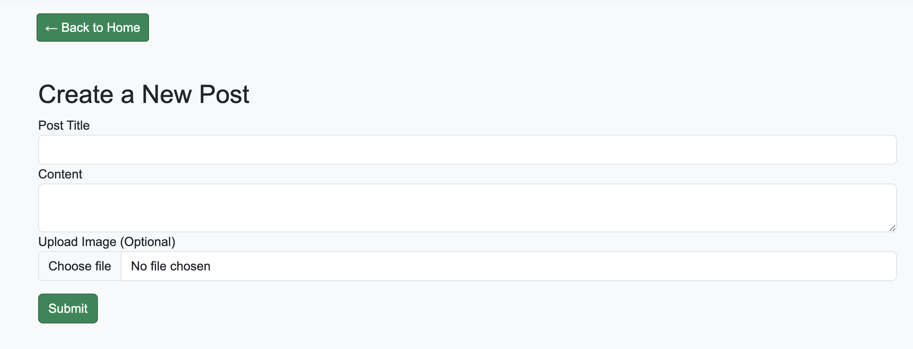  
  *Write and publish posts with rich text and images.*

- **Post & Image Comment**  
  *How comments and images appear on a post.*  
  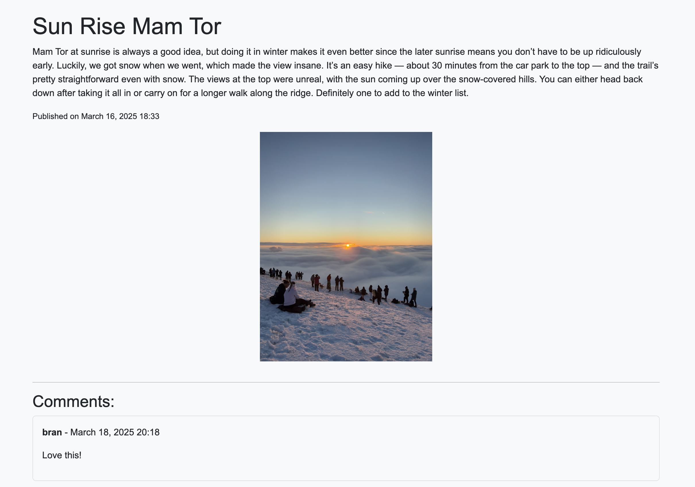  
  *This makes posts more engaging.*

- **Post Deleted Validation**  
  *Confirmation when a post is deleted.*  
  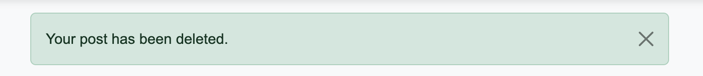  
  *You get immediate feedback when a post is removed.*

- **Post Posted Validation**  
  *Confirmation after creating a post.*  
  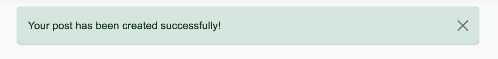  
  *The system confirms your post was published.*

- **Post One**  
  *A full view of a single post.*  
  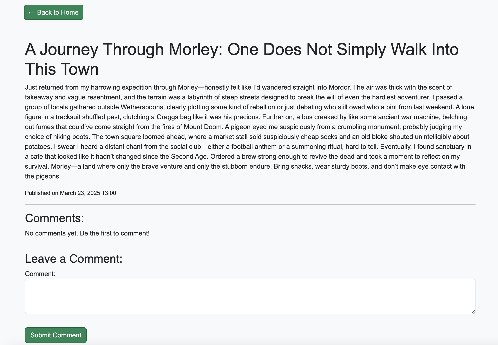  
  *See the complete post with comments and media.*

---

### 3. Testimonials

- **Create Testimonial**  
  *A screenshot of testimonial submission.*  
  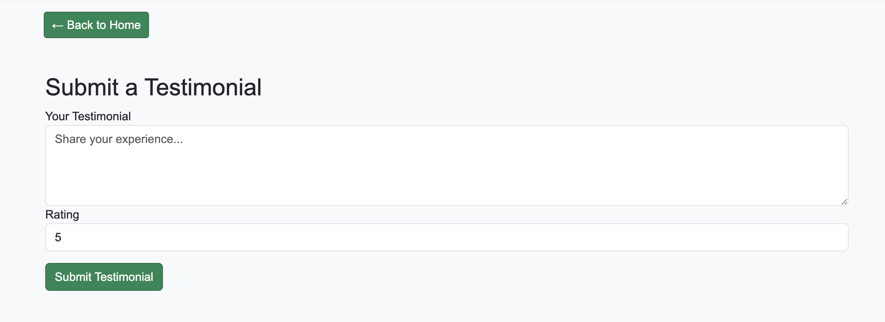  
  *Users share their experiences, which then need admin approval.*

- **Testimonial Approval Validation**  
  *Shows the approval message for a testimonial.*  
  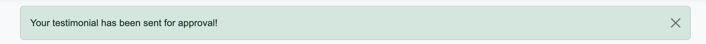  
  *Once approved, testimonials display a confirmation message.*

- **Testimonial Detail**  
  *A detailed view of a testimonial.*  
  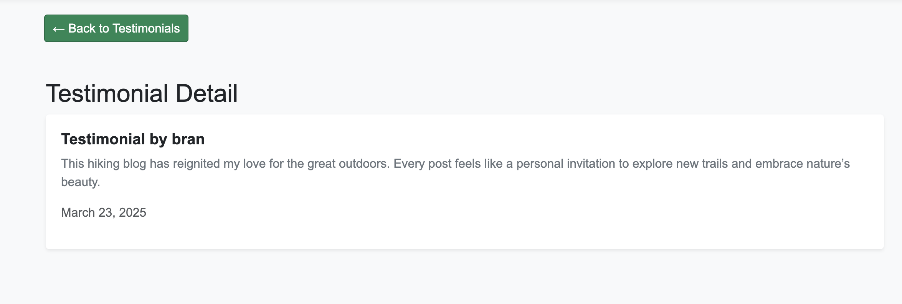  
  *View full details of a testimonial, including the author and date.*

- **Testimonials List**  
  *Displays all approved testimonials.*  
  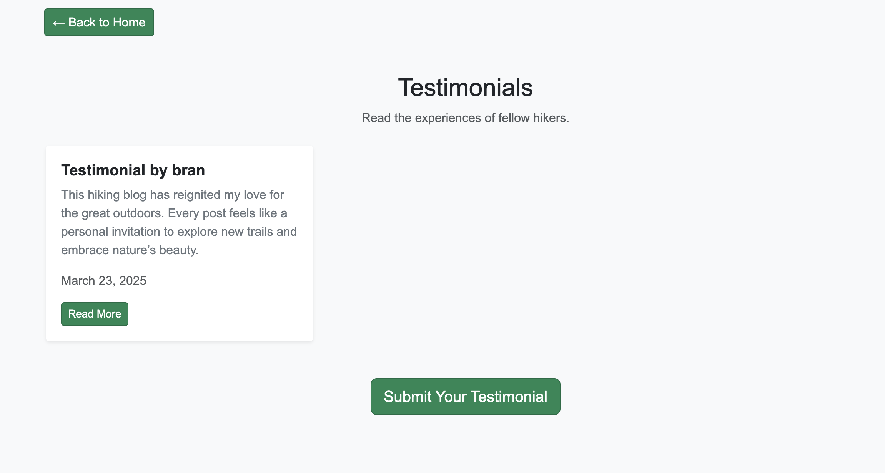  
  *See all the testimonials from the community.*

---

### 4. Profile Management & Additional Features

- **Profile View**  
  *Displays the user's profile page, including their bio, location, experience level, and Instagram handle.*  
  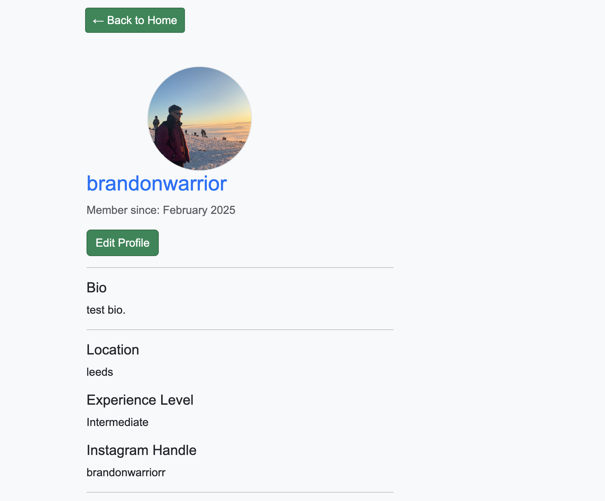

- **Your Posts**  
  *On the profile page, this section allows users to view all of their posts in one place.*  
  

- **Edit Profile**  
  *Allows users to update their profile information.*  
  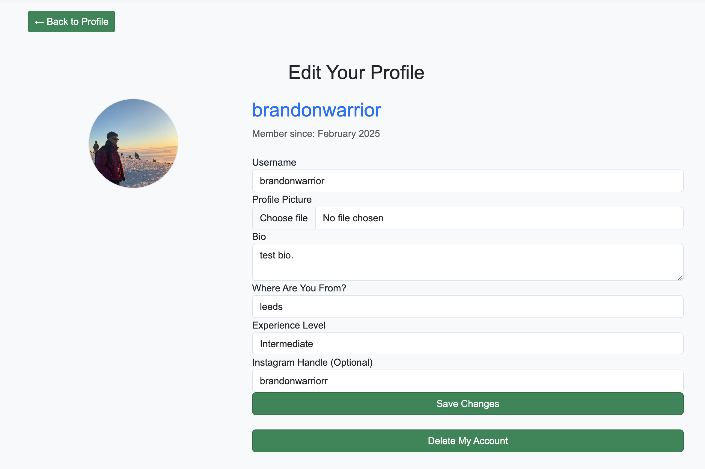  
  *Easily update your personal details.*

- **Delete Account**  
  *How users can delete their account.*  
  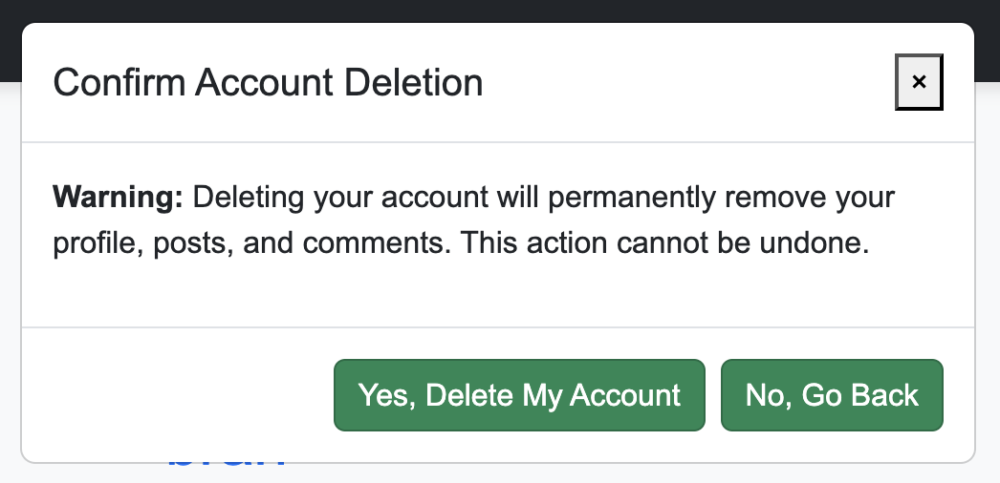  
  *A confirmation screen prevents accidental deletion.*

---

## Deployment Guide

**Important:** Make sure to add `.venv` to your `.gitignore`.

### Local Setup

#### 1. Clone the Repository
Clone the repository from GitHub to your local machine.

#### 2. Create and Activate a Virtual Environment
Open Terminal, navigate to your project directory, and run:
```bash
python3 -m venv .venv
source .venv/bin/activate
```
*Remember to add `.venv` to your `.gitignore`.*

#### 3. Install Dependencies
Install the required packages with:
```bash
pip install -r requirements.txt
```
Key dependencies for deployment include Django, Gunicorn, dj-database-url, django-cloudinary-storage, and Whitenoise.

#### 4. Run Migrations and Test Locally
Apply migrations:
```bash
python manage.py migrate
```
Then test your app:
```bash
python manage.py runserver
```
Open [http://127.0.0.1:8000/](http://127.0.0.1:8000/) in your browser to verify everything works.

### Deploying to Heroku

#### 1. Create a Heroku Application
- Log in to your Heroku account and open the Heroku Dashboard.
- Click **New** and select **Create new app**.
- Enter a unique name (e.g. `hiking-blog-1234`) and choose your region.
- Click **Create app**.

#### 2. Configure Environment Variables
Create a `.env` file in your project root (and add it to `.gitignore`) with the following:
```env
SECRET_KEY=your_django_secret_key
DEBUG=False
DATABASE_URL=your_database_url_from_heroku
ALLOWED_HOSTS=127.0.0.1,localhost,hiking-blog-1234.herokuapp.com
CLOUDINARY_CLOUD_NAME=your_cloudinary_cloud_name
CLOUDINARY_API_KEY=your_cloudinary_api_key
CLOUDINARY_API_SECRET=your_cloudinary_api_secret
```
In the Heroku Dashboard under **Settings**, click **Reveal Config Vars** and add these variables with their corresponding values.

#### 3. Configure Django Settings for Production
Ensure your `settings.py` loads environment variables and applies production security settings. For example:

```python
import os
import dj_database_url
from pathlib import Path
from dotenv import load_dotenv

load_dotenv()

BASE_DIR = Path(__file__).resolve().parent.parent
SECRET_KEY = os.getenv('SECRET_KEY')
DEBUG = os.getenv('DEBUG', 'False') == 'True'

ALLOWED_HOSTS = os.getenv('ALLOWED_HOSTS', '127.0.0.1,localhost,.herokuapp.com').split(',')

DATABASES = {
    'default': dj_database_url.config(
        default=os.getenv('DATABASE_URL'),
        conn_max_age=600,
        ssl_require=True
    )
}

STATIC_URL = '/static/'
STATICFILES_DIRS = [os.path.join(BASE_DIR, 'static')]
STATIC_ROOT = os.path.join(BASE_DIR, 'staticfiles')
STATICFILES_STORAGE = 'whitenoise.storage.CompressedManifestStaticFilesStorage'

# Production Security Settings
if not DEBUG:
    CSRF_COOKIE_SECURE = True
    SESSION_COOKIE_SECURE = True
    SECURE_SSL_REDIRECT = True
    SECURE_PROXY_SSL_HEADER = ('HTTP_X_FORWARDED_PROTO', 'https')
else:
    SECURE_SSL_REDIRECT = False
```

#### 4. Deploy via GitHub Integration (No CLI Needed)
- In the Heroku Dashboard, navigate to the **Deploy** tab.
- Under **Deployment method**, select **GitHub**.
- Connect your GitHub repository to Heroku.
- Choose the branch you wish to deploy (typically `main`) and click **Enable Automatic Deploys** if desired.
- Click **Deploy Branch** to initiate your deployment.

#### 5. Run Migrations on Heroku
After deployment, trigger the migrations from the Heroku Dashboard by opening the **More** menu and selecting **Run Console**. Then, run:
```bash
python manage.py migrate
```
Optionally, create a superuser through the console:
```bash
python manage.py createsuperuser
```

#### 6. Collect Static Files
Once deployed, collect static files by running:
```bash
python manage.py collectstatic --noinput
```
WhiteNoise will then serve these efficiently in production.

#### 7. Continuous Deployment
If you enabled automatic deploys from GitHub, any new commits to your chosen branch will trigger a new deployment on Heroku.

---

# Profile App

## Overview

The **Profile App** extends the default `User` model provided by Django to store additional user information such as a bio, profile picture, location, and experience level. This model ensures that each user has a unique profile, which is automatically created when the user registers. The app also includes the creation and management of user profiles, enabling personalized information and an enhanced user experience.

## Models and Relationships

### Profile Model

The **`Profile`** model extends the `User` model by adding fields that store additional information about the user. This model creates a **one-to-one relationship** with the `User` model, ensuring that each user has a unique profile.

#### Key Components of the Profile Model:

- **`user` (OneToOneField to `User`)**  
  A one-to-one relationship between the **Profile** and the **User**. This ensures that each user has exactly one profile, and each profile is linked to one user. You can access the profile via `user.profile`.

- **`display_name` (CharField)**  
  An optional field where the user can set a display name that may differ from their actual username. This field is optional, so it can be left blank.

- **`bio` (TextField)**  
  A text field that stores the user’s biography or a personal description. This field is optional and has a default value of an empty string, meaning users don’t have to fill it out.

- **`profile_picture` (ImageField)**  
  An optional field that allows users to upload a profile picture. The uploaded picture will be stored in the `profile_pics/` directory in the project.

- **`location` (CharField)**  
  A field for storing the user’s location, such as their city or country. It’s an optional field and can be left blank or set to null.

- **`experience_level` (CharField)**  
  This field allows the user to select their experience level from a list of choices, such as **Beginner**, **Intermediate**, or **Advanced**. This field is optional as well.

- **`instagram_handle` (CharField)**  
  An optional field for users to store their Instagram handle, allowing them to link their social media profile.

### How the Profile Model Works

- **Profile Creation:**  
  The profile is automatically created when a new user registers. This process is handled by Django signals, ensuring that users don’t need to manually create or save their profile.

- **Accessing the Profile:**  
  You can easily access a user’s profile using `user.profile`. This will return the associated **Profile** object, giving access to additional user information like their bio, location, and experience level.

## Signals for Profile Creation

Django **signals** are used to automatically create and save a profile whenever a user is created or updated. This ensures that users don’t need to manually create or save profiles.

### `create_user_profile` Signal

The **`create_user_profile`** signal listens to the **`post_save`** event for the **User** model. When a new **User** is created, it automatically creates a **Profile** for the user (if one doesn’t already exist).

This signal ensures that every new user has an associated **Profile**.

### `save_user_profile` Signal

The **`save_user_profile`** signal ensures that whenever the **User** is saved, their corresponding **Profile** is also saved. This helps keep the profile data up to date when changes are made to the user.

For example, if the user updates their username or other attributes, the profile is updated automatically as well, making sure the data remains consistent.

## Profile Access and Management

The **Profile** model allows users to manage and update their personal information such as bio, profile picture, location, and experience level. The profile management system is essential for personalizing the user experience and ensuring that the profile stays up-to-date with changes made by the user.

---

## Profile Update Form

To allow users to update their profiles, we use the **ProfileUpdateForm**. This form handles the updating of profile details, including the user’s username, bio, profile picture, and more. When the user updates their profile, the changes are saved to both the profile and the user model (e.g., if the username is changed).

## Model Relationships

### User to Profile

There is a **one-to-one relationship** between the **User** and **Profile** models. Each **User** has exactly one **Profile**, and each **Profile** is linked to one **User**. This ensures that every user has a unique profile and no user shares a profile.

You can access a user’s profile using `user.profile`. This relationship ensures that each user has a unique profile that contains extra information tied to their account.

---

## Views

### Profile View

The **Profile View** displays the user's profile page, showing their bio, location, experience level, and other details. This view allows users to view their personal information and the posts they've created.

### Edit Profile View

The **Edit Profile View** allows authenticated users to update their profile information, including their username, bio, profile picture, location, and experience level. After successful editing, the changes are saved to both the profile and the user model.

### Delete Account View

The **Delete Account View** allows users to delete their accounts, including all associated posts and comments. After deletion, users are redirected to the home page, with a success message confirming account removal.

---

## Account Deletion Modal & JavaScript

The **Account Deletion Modal** provides an extra layer of confirmation before permanently deleting a user’s account. This modal prevents accidental account deletions and ensures the process is intentional.

### How the Modal Works:

- **Modal Activation:**  
  When the user clicks the "Delete Account" button, the modal appears, prompting them for confirmation.

- **Cancel Option:**  
  Users can cancel the deletion by clicking the "Cancel" button, which closes the modal without making changes.

- **Confirm Option:**  
  If the user confirms, the account deletion form is submitted, and their account is deleted, along with any related data.

- **JavaScript Handling:**  
  The modal’s visibility is controlled by JavaScript. It listens for user actions like clicking the "Delete Account" button to show the modal or clicking "Cancel" or "Close" to hide the modal. The JavaScript also handles submitting the deletion form when confirmed.

This ensures that account deletion is a clear, deliberate process that minimizes the risk of accidental account removal.

---

## Conclusion

The **Profile App** provides enhanced personalization for each user by linking their profile to the `User` model. With the addition of automatic profile creation via Django signals and the ability to manage profile information through the **ProfileUpdateForm**, the app ensures that user data is consistently up-to-date. The **Account Deletion Modal**, facilitated by JavaScript, adds an extra layer of security and user control, ensuring that account deletions are intentional.

This makes the **Profile App** a seamless, user-friendly experience, while also maintaining the integrity and security of user data.


--- 


# Blog App

## Overview

The **Blog App** is responsible for managing blog posts and comments within the **UK Hikes** platform. It allows users to create, edit, and delete posts, as well as comment on posts. This app is essential for allowing users to share their hiking experiences and engage with the community.

### Features:
- **User Authentication**: Only authenticated users can create, edit, and delete posts and comments.
- **Post Management**: Users can create, update, and delete their own posts.
- **Comment Management**: Users can comment on posts, and administrators can moderate comments.
- **Pagination**: Posts are paginated on the homepage for better user experience.
- **Cloudinary for Image Storage**: Images for blog posts are managed using Cloudinary, providing cloud-based storage, automatic image resizing, and optimization.

---

## Models and Relationships

The **Blog App** consists of two main models: **Post** and **Comment**. These models have relationships with each other and with the **User** model, which is the default model for user accounts.

### Post Model

The **Post** model represents a blog post written by a user. Each post has several fields that describe the content of the post and its associated image. A **ForeignKey** is used to associate each post with a user (author), and a **Many-to-One** relationship exists between the Post and Comment models.

- **`title`**: The title of the post.
- **`slug`**: A unique identifier for the post, used for generating URLs.
- **`content`**: The main content of the post.
- **`author`**: A reference to the user who wrote the post. This is a foreign key that links the post to a **User** model.
- **`created_at`**: The date and time when the post was created.
- **`status`**: The status of the post (draft or published).
- **`image`**: An optional image associated with the post, stored using Cloudinary for efficient handling of media.

### Comment Model

The **Comment** model represents a comment made by a user on a blog post. Comments are linked to a specific post, and each comment is associated with a user (author). The relationship between the Post and Comment models is a **one-to-many relationship**, where each post can have multiple comments.

- **`post`**: A reference to the associated **Post** model.
- **`author`**: A reference to the **User** model, representing the comment’s author.
- **`content`**: The text content of the comment.
- **`created_at`**: The date and time when the comment was made.
- **`approved`**: A boolean flag indicating whether the comment has been approved by an admin.

### Post-Comment Relationship

A **one-to-many relationship** exists between the **Post** and **Comment** models. Each post can have multiple comments, but each comment is tied to a single post. Comments are fetched and displayed with their associated post when viewing a post's detail page.

---

## Views

The **Blog App** includes several views that handle the display and management of posts and comments.

### Home View

The **Home View** displays a list of all **published posts**. The posts are paginated, so users can view them in manageable chunks. Each post is displayed with its title, a snippet of its content, and its creation date.

### Post Detail View

The **Post Detail View** displays the full content of a single post, including the post's image, title, content, and the associated comments. Users can also submit new comments on the post. The comments are displayed below the post, and the comment form is available for authenticated users to leave their feedback.

### Create Post View

The **Create Post View** allows authenticated users to write a new blog post. Users can fill out a form with a title, content, and optional image for their post. Once the post is submitted, it is automatically published and saved.

### Edit Post View

The **Edit Post View** allows users to edit their own blog posts. A user can update the title, content, and image of their post. After the update, the post is automatically saved and marked as published.

### Delete Post View

The **Delete Post View** allows users to delete their own blog posts. Once deleted, the user is redirected back to the homepage, and a success message is displayed.

### Edit Comment View

The **Edit Comment View** allows users to edit their own comments on a post. If a comment is edited successfully, the changes are saved, and the user is redirected back to the post detail page.

### Delete Comment View

The **Delete Comment View** allows users to delete their own comments. Once deleted, the user is redirected back to the post detail page with a success message.

---

## Forms

The **Blog App** uses Django’s forms to handle the creation and editing of posts and comments. Forms are validated to ensure that required fields are filled in and that the data is formatted correctly.

### PostForm

The **PostForm** is used for creating and editing blog posts. It ensures that the title and content are provided and validates the input data.

### CommentForm

The **CommentForm** is used for submitting new comments on blog posts. It ensures that the content of the comment is not empty and that it meets the validation requirements.

---

## URLs

The **Blog App** includes various URL patterns to handle the different views. These include URLs for viewing the homepage, creating and editing posts, viewing post details, and managing comments.

- The homepage (`/`): Displays the list of published posts.
- The create post view (`/post/create/`): Allows users to create a new post.
- The post detail view (`/post/<slug>/`): Displays a detailed view of a single post.
- The edit post view (`/post/<int:pk>/edit/`): Allows users to edit their own posts.
- The delete post view (`/post/<int:pk>/delete/`): Allows users to delete their own posts.
- The edit comment view (`/comment/<int:comment_id>/edit/`): Allows users to edit their own comments.
- The delete comment view (`/comment/<int:comment_id>/delete/`): Allows users to delete their own comments.

---

## Admin Interface

The **Blog App** includes customizations for managing posts and comments in the Django admin interface.

### Post Admin

The **Post Admin** interface allows administrators to manage blog posts. It includes options to search, filter by status and creation date, and prepopulate the slug field.

### Comment Admin

The **Comment Admin** interface allows administrators to manage comments. It includes options to approve or disapprove comments and filter them by approval status or creation date.

---

## Conclusion

The **Blog App** is an essential part of the **UK Hikes** platform, allowing users to share their hiking experiences, interact with other users, and engage in discussions. The integration of features such as pagination, user authentication, comment moderation, and Cloudinary for image storage helps enhance the overall user experience.


---


# Testimonials App

## Overview

The **Testimonials App** allows users to submit testimonials about their hiking experiences. These testimonials are submitted for approval and displayed on the platform once approved. The app handles the creation, submission, and listing of testimonials, enabling users to share their personal experiences with the community.

### Features:
- **Testimonial Creation**: Users can submit testimonials which are sent for approval.
- **Testimonial Listing**: Approved testimonials are displayed for other users to read.
- **AJAX Submission**: Testimonial submissions are processed via AJAX, providing an interactive experience.
- **Admin Approval**: Admins have the ability to approve or disapprove testimonials.

---

## Models and Relationships

The **Testimonials App** includes a single model, **Testimonial**, which represents the user-submitted content. This model is related to the **User** model to identify the author of each testimonial.

### Testimonial Model

The **Testimonial** model represents a user's experience shared as a testimonial. It includes fields for storing the content of the testimonial, a rating system, and an approval flag. Each testimonial is linked to a user via a foreign key relationship, ensuring that every testimonial is tied to a specific user.

- **`author` (ForeignKey to User)**: A foreign key to the `User` model, identifying the user who submitted the testimonial.
- **`content` (TextField)**: The content of the testimonial. This field stores the user's written testimonial about their hiking experience.
- **`rating` (IntegerField)**: A numeric rating from 1 to 5, allowing users to rate their hiking experience.
- **`created_at` (DateTimeField)**: A timestamp for when the testimonial was created.
- **`approved` (BooleanField)**: A flag indicating whether the testimonial has been approved by an admin. Only approved testimonials will be displayed publicly.

### How the Testimonial Model Works
- **Testimonial Creation**:  
  Users can create testimonials through a form. These testimonials are first submitted for approval and will not appear publicly until an admin has approved them.
- **Accessing the Testimonial**:  
  You can easily retrieve a user's testimonial using the `testimonial.author` relationship. Admins can manage testimonials through the admin interface to approve or disapprove them.

---

## Views

The **Testimonials App** includes several views that handle the submission and display of testimonials.

### Create Testimonial View

This view allows logged-in users to submit a new testimonial. It processes the form data, validates it, and then saves it for review. Upon successful submission, a JSON response is sent back to the user indicating success or failure.

- **AJAX Form Submission**:  
  The form is submitted using AJAX, so the page does not reload. Users will see a message indicating whether the testimonial was submitted successfully or if there was an error.

### Testimonial List View

This view displays a list of all approved testimonials. Testimonials are sorted in descending order based on their creation date. Only testimonials marked as approved will be shown.

### Testimonial Detail View

The detail view displays the full content of a single testimonial. It is accessed by clicking on a testimonial from the list. This view provides a more detailed view of the user's experience, including the content and rating.

---

## Forms

The **Testimonials App** uses Django's forms to handle the submission of new testimonials. These forms ensure that all necessary fields are filled in, and they provide validation to ensure the submitted testimonial is valid.

### TestimonialForm

The **TestimonialForm** is used for creating and updating testimonials. It includes fields for the testimonial's content and rating, and it ensures that the content is not empty. The form is also used to validate the input before submission.

---

## URLs

The **Testimonials App** includes several URL patterns that correspond to the views for creating, listing, and displaying testimonials.

- **Create Testimonial**: (`/testimonials/testimonial/create/`)  
  Users can submit a new testimonial.
- **Testimonial List**: (`/testimonials/list/`)  
  Displays a list of all approved testimonials.
- **Testimonial Detail**: (`/testimonials/testimonial/<int:id>/`)  
  Displays the full details of a single testimonial.

---

## Conclusion

The **Testimonials App** is an integral part of the **UK Hikes** platform, allowing users to share their experiences with the community. The app integrates with the user authentication system, uses AJAX for smooth submissions, and includes admin controls for moderating submitted testimonials. This system provides a seamless and interactive way for users to contribute and share their hiking experiences.


# Admin Configuration for UK Hikes

The **UK Hikes** platform uses Django’s **admin interface** to manage content such as blog posts, comments, testimonials, and user profiles. The customisations in the admin interface improve the content management experience, making it easier for administrators to oversee and moderate the platform's content.

## Profile App Admin Configuration

The **Profile App** manages user profiles, extending the default **User** model with additional information such as the user's bio, profile picture, and experience level. In the admin interface, this allows administrators to manage user profiles.

### Features of Profile Admin:
- **User Profile Management**: Admins can view and manage the profiles of users.
- **List Display**: Admins can see details like the **user's display name**, **bio**, **profile picture**, and **experience level**.
- **Search Functionality**: Admins can search for user profiles based on the **display name** or **username**.
- **Editable Profile Fields**: Admins can update profile information, such as the user’s bio or profile picture.
  
This configuration provides an easy-to-use interface for administrators to manage user profiles and ensure they are up-to-date.

## Blog App Admin Configuration

The **Blog App** handles blog posts and comments within the **UK Hikes** platform. Admins can manage posts, comments, and authorship through the Django admin interface.

### Post Admin Configuration:
The **Post** model allows users to create, edit, and delete blog posts. The **PostAdmin** interface is used to manage these posts.

#### Features of Post Admin:
- **List Display**: Admins can view important details such as the **title**, **author**, **created_at**, and **status** of each post.
- **Search Functionality**: Admins can search posts based on the **title** or **content**.
- **List Filters**: Admins can filter posts by **status** (published or draft) or creation date.
- **Prepopulated Slug**: Automatically generates URLs for blog posts based on the post's title.

### Comment Admin Configuration:
The **Comment** model represents user comments on blog posts. The **CommentAdmin** interface allows admins to moderate these comments.

#### Features of Comment Admin:
- **List Display**: Shows the **author**, **post**, **created_at**, and **approved** status of each comment.
- **Search Functionality**: Allows searching for comments based on the **author's username** or **content**.
- **List Filters**: Filters comments by their **approved** status and creation date.
- **Custom Actions**: Admins can approve multiple comments at once using the **approve_comments** action.

These features help administrators effectively manage blog posts and comments, ensuring the content remains relevant and engaging for users.

## Testimonials App Admin Configuration

The **Testimonials App** allows users to submit testimonials about their hiking experiences, which can be reviewed and approved by administrators. The **TestimonialAdmin** interface helps manage these submissions.

### Features of Testimonial Admin:
- **List Display**: Admins can view key details like the **author**, **content**, **created_at**, and **approved** status of each testimonial.
- **List Filters**: Admins can filter testimonials based on their **approved** status or creation date.
- **Custom Actions**: Admins can approve selected testimonials in bulk using the **approve_testimonials** action.

This admin configuration ensures that only approved testimonials are visible to the public, and it gives administrators the ability to moderate content efficiently.

## User Admin Configuration

The **User App** manages user accounts and extends the default **User** model for custom user management. The **CustomUserAdmin** interface allows administrators to manage users within the platform.

### Features of User Admin:
- **Fieldsets**: Organises the display of user information, including personal details, permissions, and important dates.
- **User Search**: Admins can search users by **email** or **username**.
- **Ordering**: Users are ordered by **email** in the list view, which helps in easily locating user accounts.
- **Permissions**: Admins can modify user permissions such as whether they are staff, active, or a superuser.

The **CustomUserAdmin** makes it easier for administrators to manage user accounts with additional user information, including permissions and activity status.

## Conclusion

The **Admin Configuration** for the **UK Hikes** platform is customised to enhance the management and moderation of various app components, including **user profiles**, **blog posts**, **comments**, and **testimonials**. The use of **custom actions**, **list filters**, and **prepopulated fields** streamlines the content management process, allowing administrators to maintain a smooth user experience while ensuring that content stays relevant and high quality. These admin customisations also make it easier for administrators to approve, manage, and moderate content across the platform.


## Cloudinary Integration

The **UK Hikes** platform uses **Cloudinary** for storing images uploaded for blog posts, including any images associated with testimonials. Cloudinary provides an easy and efficient way to handle media files, optimize images, and improve the user experience with fast image delivery.


---

## Credits

- **Django Framework** – for powering the web application.
- **Bootstrap** – for the responsive design.
- **Django-Allauth** – for handling user authentication.
- **Heroku** – for cloud hosting.
- **Stack Overflow** – for troubleshooting and debugging.
- **Code Institute** – for guidance throughout the project.
- **Favicon** - For adding a Favicon to the website.
