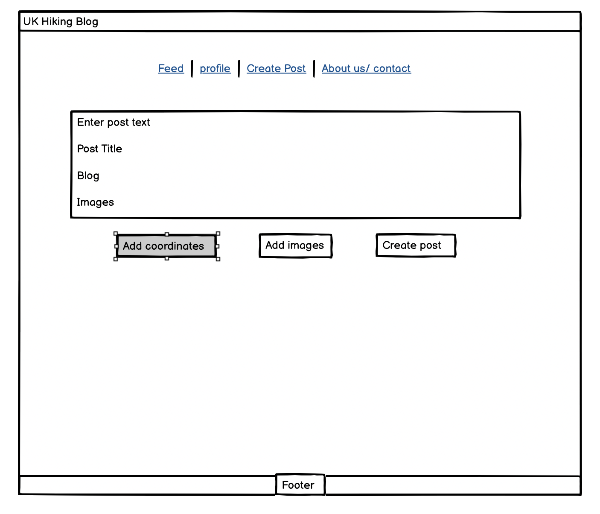
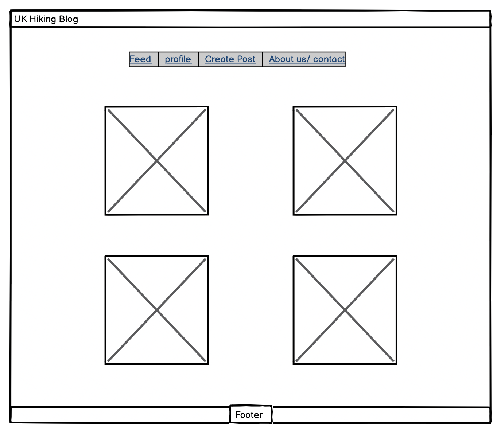

# Hiking Blog

## Overview

The **Hiking Blog** is a platform for outdoor enthusiasts to share, discover, and engage with hiking experiences. Users can create posts about their adventures, upvote or comment on other posts, and filter hikes by location and difficulty. The application is designed to be fully responsive and accessible across all devices.

For project planning, see: [Project Planning](planning.md)

For project testing see: [Project Testing](testing.md)
---

## Features

### Core Features (MVP)

1. **User Registration and Authentication**:
   - Secure user registration, login, and profile updates using **Django-Allauth**.
   
2. **Post Management**:
   - Users can create, edit, and delete hiking posts with details such as title, content, location, and difficulty.
   - **Search** for posts by title or content.

3. **Community Interaction**:
   - Users can comment on posts to engage in discussions with other hikers.
   
4. **Admin Moderation**:
   - Admins can moderate posts, comments, and users to ensure a positive community environment.

5. **Responsive Design**:
   - Fully responsive and mobile-friendly UI for desktop, tablet, and mobile devices.

### Future Features:
- **Location and Difficulty Filtering**: Implement filters for posts based on location and difficulty (planned for future development).
- **Upvote/Downvote System**: Allow users to upvote or downvote posts to highlight helpful content.
- **Hike Rating**: Implement a rating system for each hike.

---

## Input Validation

The application implements robust **input validation** to ensure proper data handling and prevent errors:

1. **User Registration**:
   - Ensures users cannot submit empty or invalid email addresses or weak passwords.

2. **Post Creation**:
   - Ensures that all required fields (title, content, location, difficulty) are filled out before submission.
   
3. **Commenting**:
   - Validates that comments are within acceptable length and format.

4. **Login and Authentication**:
   - Ensures valid credentials are required for login, and handles incorrect login attempts.

---

## How to Use the Site

The **Hiking Blog** is designed to be intuitive and easy to use. Below are the steps to navigate and interact with the site.

### 1. **Registering and Logging In**
- Users must create an account to submit posts and interact with the community. Once logged in, they can manage their posts and profile.

### 2. **Creating a Post**
- After logging in, users can create a post about a hiking adventure by providing a title, content, location, and difficulty level.

### 3. **Browsing and Interacting with Posts**
- The homepage displays all posts, where users can browse hikes, comment, and view testimonials from other users.

### 4. **Leaving a Testimonial**
- Users can leave a testimonial for hikes they have completed, sharing personal insights and experiences.

### 5. **Commenting and Engaging with the Community**
- Users can comment on posts, ask questions, and provide feedback on the content shared by other hikers.

---

## Future Developments/Enhancements

1. **Location and Difficulty Filtering**: A filter to allow users to search posts based on location and difficulty (currently planned for future development).
2. **Upvote/Downvote System**: This feature will allow users to upvote or downvote posts and testimonials, similar to a Reddit-style interaction.
3. **Hike Rating**: A rating system will be added so users can rate hikes based on their experience, making it easier for others to find the best hikes.
4. **User Profile Enhancements**: Future improvements may allow users to upload profile images and more customization options for their profiles.

---

## Deployment

To deploy this app on **Heroku**, follow these steps:

1. Fork or clone the repository.
2. Create a new Heroku app.
3. Set up the necessary environment variables (e.g., `DEBUG=False`, `SECRET_KEY=<your_secret_key>`).
4. Link the repository to Heroku and deploy it using Git.
5. Run `python manage.py migrate` to apply migrations on Heroku.

---

## Credits

- **Django Framework** for powering the web application.

- **Bootstrap** for the responsive design.

- **Django-Allauth** for handling user authentication.

- **Heroku** for cloud hosting.

- **Stack Overflow** for troubleshooting and debugging various issues.

- **Code Institute** for providing guidance on this project.

- **Images**: Wireframes and screenshots used throughout the documentation come from the planning phase and actual development process.
