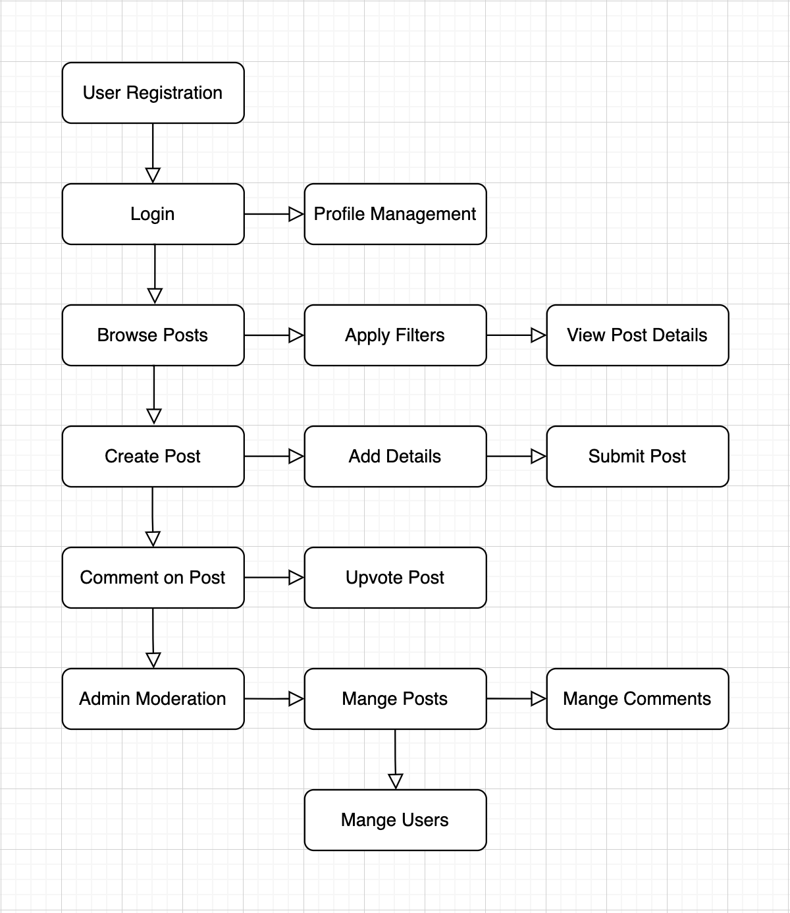
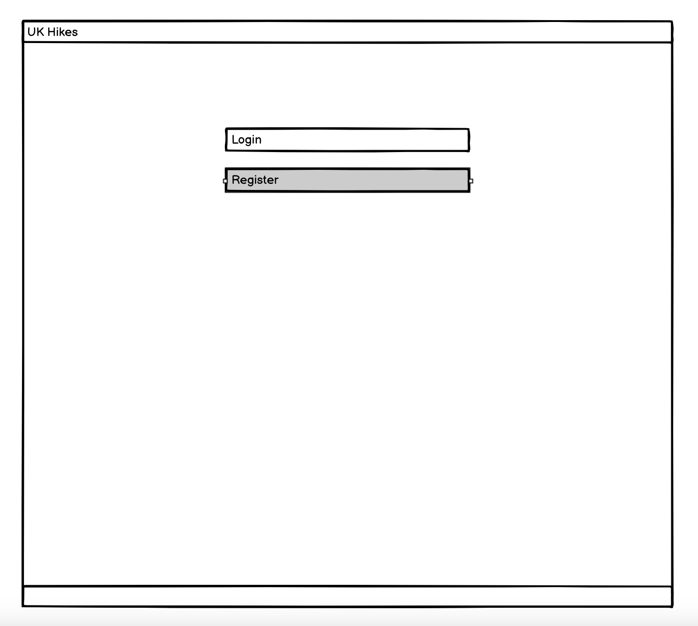
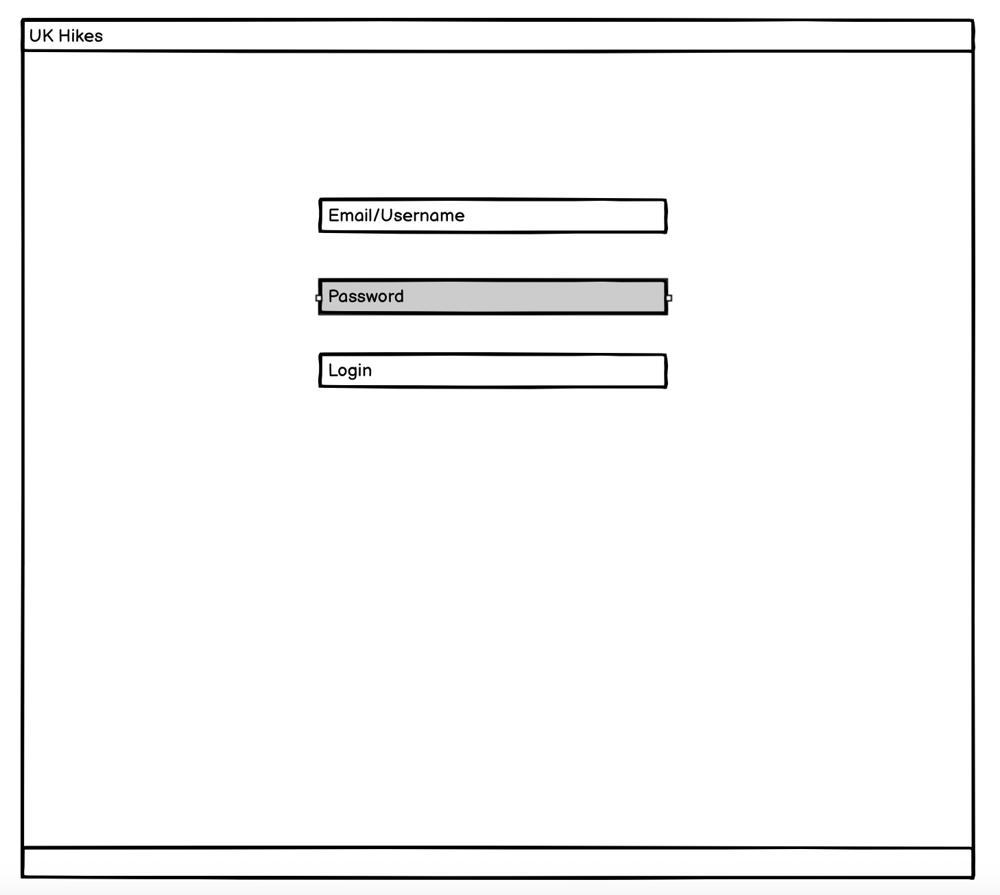
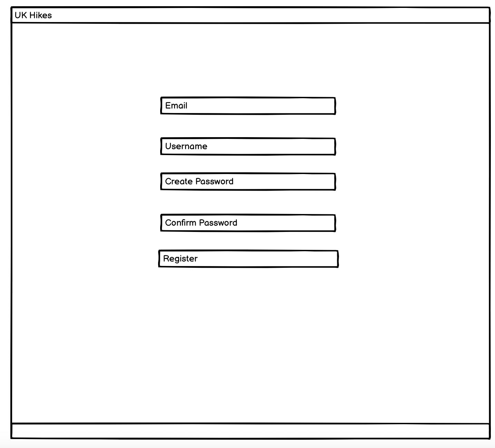
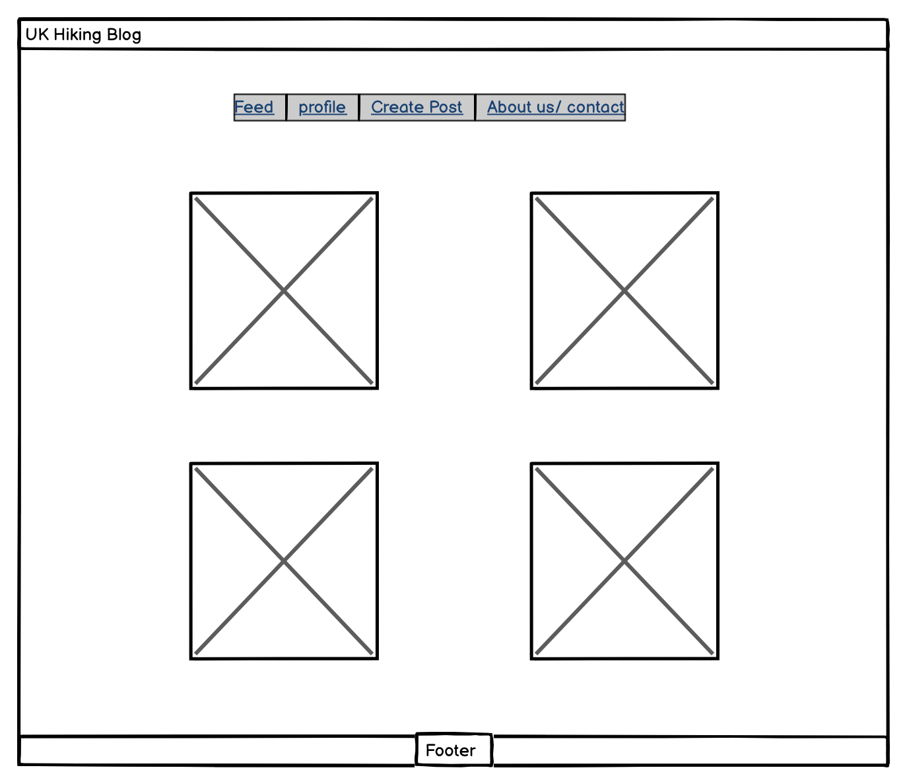
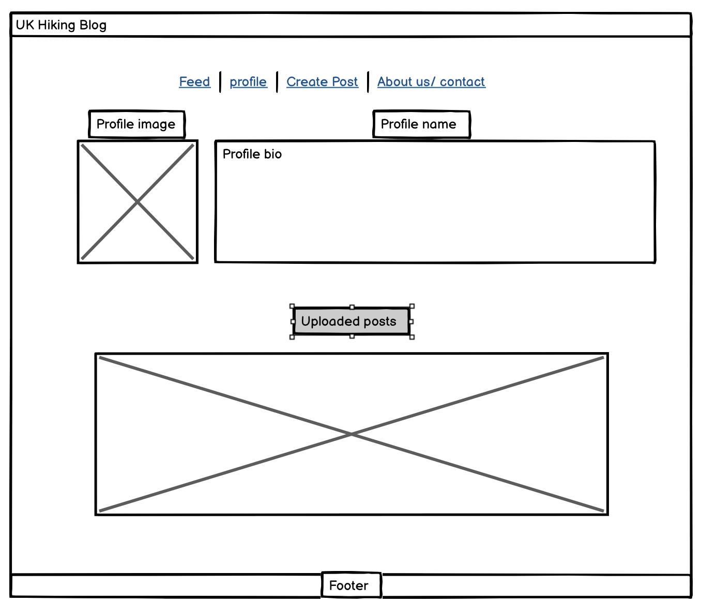
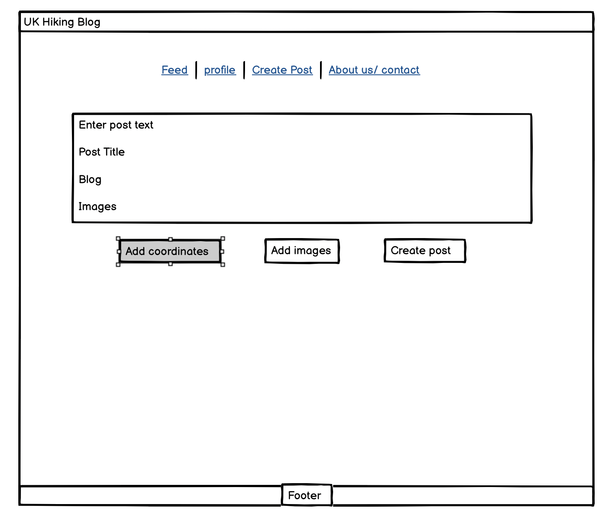

# **UK Hikes - Project Planning**

### **Target Client:**
- The target audience of the UK Hikes project remains the same: hiking enthusiasts across the UK who want to share their hiking experiences, post blog content, and connect with like-minded individuals. However, the addition of **testimonials** is a result of feedback suggesting that users would benefit from an area to share more structured content.

---

## **1. Minimum Viable Product (MVP)**
The **UK Hikes** platform will allow users to:
- **Register and log in** to their account.
- **Create and browse hiking posts** with location and difficulty filters.
- **Comment on and upvote posts** to engage with the hiking community.
- **Filter hikes by location and difficulty** to find relevant hikes.
- **Ensure a fully responsive design** for easy navigation on any device.

---

## **2. User Stories**
User stories are categorised into **Epics** for structured development.

### **Epic 1: User Authentication**
- **As a user**, I can register and log in so that I can access the site's features.
- **As a user**, I can update my profile so that I can personalize my experience.

### **Epic 2: Post Management**
- **As a user**, I can create hiking posts with title, content, location, and difficulty.
- **As a user**, I can browse posts by location and difficulty so that I can find hikes that interest me.

### **Epic 3: Community Interaction**
- **As a user**, I can comment on posts so that I can engage in discussions with other hikers.
- **As a user**, I can upvote/downvote posts so that I can highlight helpful content.

### **Epic 4: Post Organization and Filtering**
- **As a user**, I can filter posts by location and difficulty to find hikes that match my needs.

### **Epic 5: Responsive Design**
- **As a user**, I can access the blog on any device so that I can browse hiking content easily.

### **Epic 6: Admin Moderation**
- **As an admin**, I can delete inappropriate posts or comments to maintain a positive community.

### **Future Enhancements (Not MVP)**
- **As a user**, I can use a contact form to send feedback or inquiries to the platform administrators.
- **As an admin**, I can view analytics on post activity to identify popular topics.

---

## **Flowchart**

The flowchart illustrates the user journey in the **UK Hikes** platform. Below is a breakdown of the steps shown in the flowchart:

1. **User Registration**  
   - The process starts with user registration, where users create an account on the platform.
   
2. **Login**  
   - Once registered, users log in to access the platform's features.
   
3. **Profile Management**  
   - Users can manage their profiles, including updating personal details, profile images, and other customizable information.

4. **Browse Posts**  
   - After logging in, users can browse hiking posts available on the platform.

5. **Apply Filters**  
   - Users can apply filters to refine their search based on specific criteria (though not fully implemented, as discussed).

6. **View Post Details**  
   - Users can view detailed information about a particular post once they select one from the list.

7. **Create Post**  
   - Users can create a new hiking post, adding title, content, and optional images.

8. **Add Details**  
   - Users add detailed information about their hike, such as location, difficulty, and description.

9. **Submit Post**  
   - Once all details are added, users can submit their post for publication.

10. **Comment on Post**  
    - Users can interact with posts by commenting on them.

11. **Upvote Post**  
    - Users can upvote posts (though this feature is planned for future development).

12. **Admin Moderation**  
    - Posts and comments may be subject to admin moderation, where the admin can review and take action on posts or comments.

13. **Manage Posts**  
    - Admins can manage the posts submitted by users, including approval, rejection, or editing of posts.

14. **Manage Comments**  
    - Admins can manage comments, including approving or deleting inappropriate comments.

15. **Manage Users**  
    - Admins can also manage users, which could include banning or editing user details.

---

## **Wireframes**
Below are the planned wireframes for the key pages:

### **Login Screen**
- Allows users to log in to their account.

### **Register New Account Screen**
- Allows new users to create an account.

### **Feed Screen**
- Displays a feed of hiking posts with filters for **location and difficulty**.

### **Profile Page**
- Displays **user information, their posts, and edit profile options**.

### **Create Post Page**
- Allows users to **submit a new hiking post** with title, content, and optional images.

---

## **4. Project Workflow**
- This project follows **Agile methodology** with sprints:
  - **Sprint 1:** User authentication and basic post creation.
  - **Sprint 2:** Comments and upvotes for community interaction.
  - **Sprint 3:** Filtering and categorization of posts.

- All **issues and tasks** will be tracked on **GitHub Issues**.

---

## **3. Changes Made From the User Stories and Why**

While the core functionality from the original planning still remains intact, some adjustments have been made based on the project's development and feedback from manual testing.

### **1. Removed Post Filtering by Location and Difficulty**
- **Original User Story:**  
  - **As a user**, I can filter posts by location and difficulty to find hikes that match my needs.

- **Reason for Change:**  
  The filtering of posts by location and difficulty was initially planned but was **removed to focus on core features** for the first release. This decision was made to ensure that essential features such as post creation, commenting, and engagement with content could be properly developed and tested. Filtering posts by location and difficulty will be **revisited as a future enhancement** once the foundational features of the site are more established and the user base has grown.

### **2. Added Location and Experience Level to Profile Customization**
- **Original User Story:**  
  - **As a user**, I can update my profile.

- **Reason for Change:**  
  Instead of implementing the post filtering by location and difficulty, **location** and **experience level** were added to the **profile customization**. This new feature allows users to personalize their profiles by selecting their location and experience level. It offers a more tailored experience for users, enabling them to share relevant hiking information and connect with others based on shared experiences. 

  These changes align with the goal of fostering a stronger sense of community and improving user engagement. It also adds flexibility for future features like recommending hikes based on experience level, which can be implemented once the foundational features are stable.

### **3. Removed Post Upvotes**
- **Original User Story:**  
  - **As a user**, I can comment on and upvote posts to engage with the hiking community.

- **Reason for Change:**  
  The **upvoting system** for posts was **removed** to simplify the initial release and focus on core features like posts, comments, and testimonials. Upvoting was considered a secondary feature, and its removal allowed for a more streamlined experience. This feature will be revisited in the future to further enhance community engagement.

### **4. Substitution of Upvotes with Testimonials**
- **Original User Story:**  
  - **As a user**, I can upvote posts to engage with the hiking community.

- **Reason for Change:**  
  Instead of implementing upvotes, the project introduced **user testimonials** as a way to engage the community. Testimonials allow users to share their personal hiking experiences, which are reviewed and approved by admins. This change adds value by providing a personal touch to the content, and allows for an alternative form of community interaction.

---

## **Future Developments**

As we continue to improve the **UK Hikes** platform, several features from the original user stories, as well as new ideas, will be added in the future. These enhancements are designed to improve the user experience and encourage greater community engagement.

### **1. Location and Difficulty Filtering**
- **Originally outlined in the user stories**, this feature to filter and sort posts by **location** and **difficulty** will be revisited and implemented in future updates. Once the core features are stable and user feedback is gathered, the filtering system will be added to help users find hikes that match their preferences.

### **2. Hike Rating System**
- The **hike rating** system will allow users to **rate hikes** based on their experiences. This feature, originally planned as part of the user stories, will be introduced in future releases to provide more feedback for hikes and assist other users in identifying the most highly recommended trails.

### **3. Upvote/Downvote System**
- A **community-driven upvote/downvote system** will be reintroduced in future updates. This system will allow users to upvote or downvote hikes, posts, or testimonials based on their usefulness. The goal is to highlight valuable content and create more interaction within the community.

### **4. User Profile Enhancements**
- **Display Profile Information on Posts:**  
  Users will be able to display their **username** and **profile picture** on their posts to improve community recognition and interaction.
  
- **Follow Feature:**  
  A **follow button** will be added to user profiles, allowing users to follow other hikers. This will ensure they can stay updated on their posts, new testimonials, and other activities. Additionally, this feature will help build a more connected community on the platform.

### **5. Enhanced Testimonials Features**
- As testimonials are currently reviewed by admins, future updates may include the ability for **users to edit or delete** their own testimonials, providing them with more control over the content they contribute.
