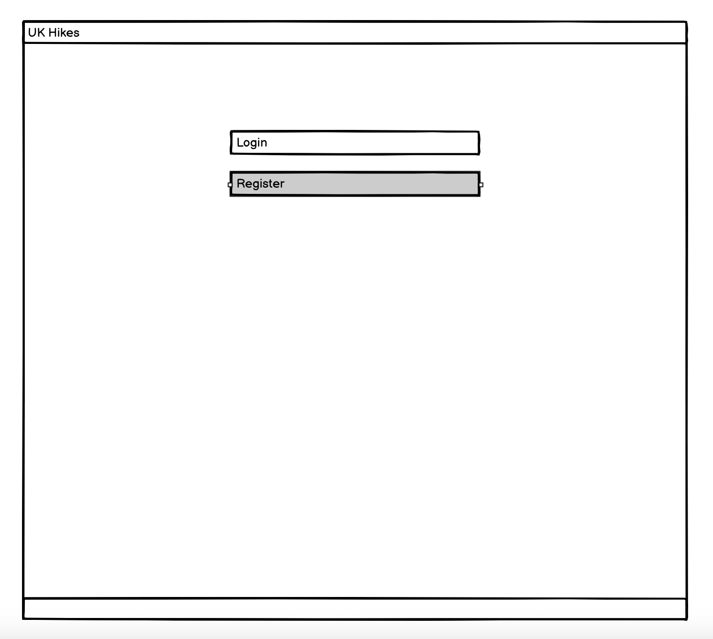
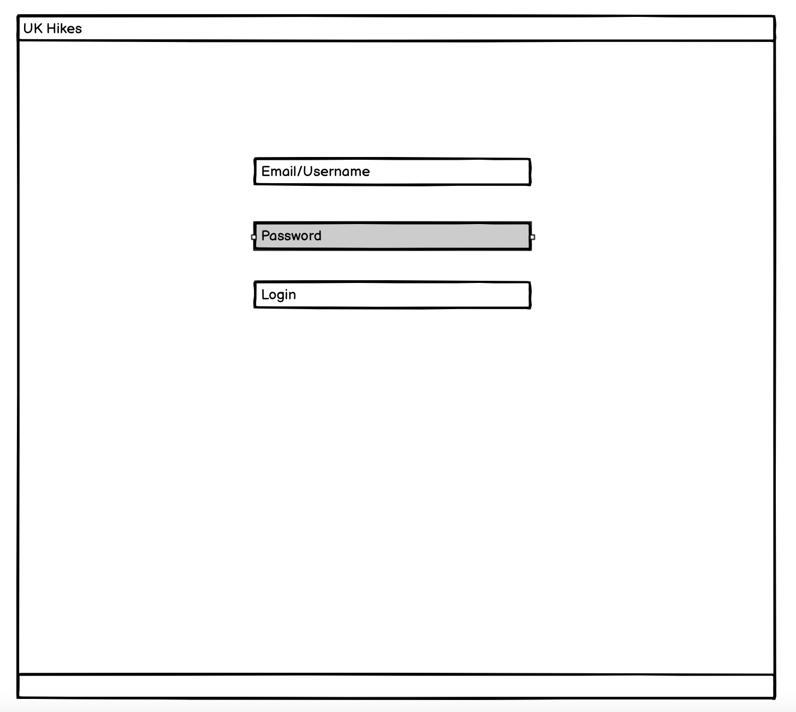
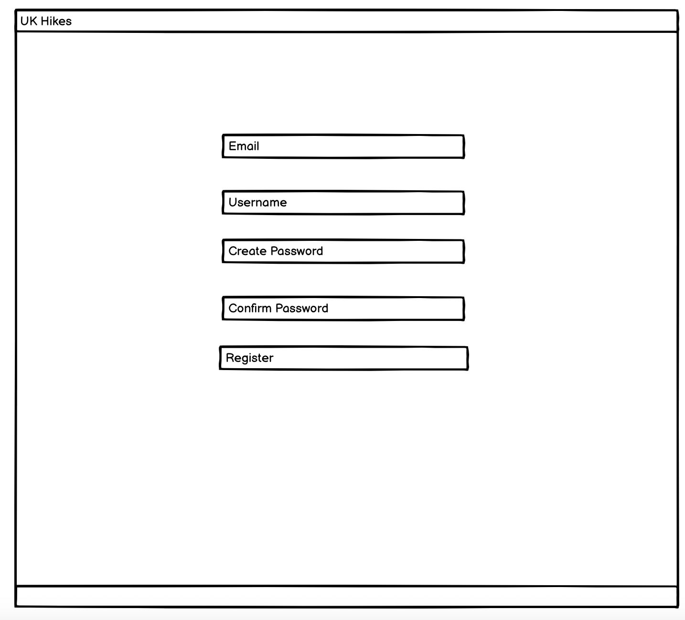
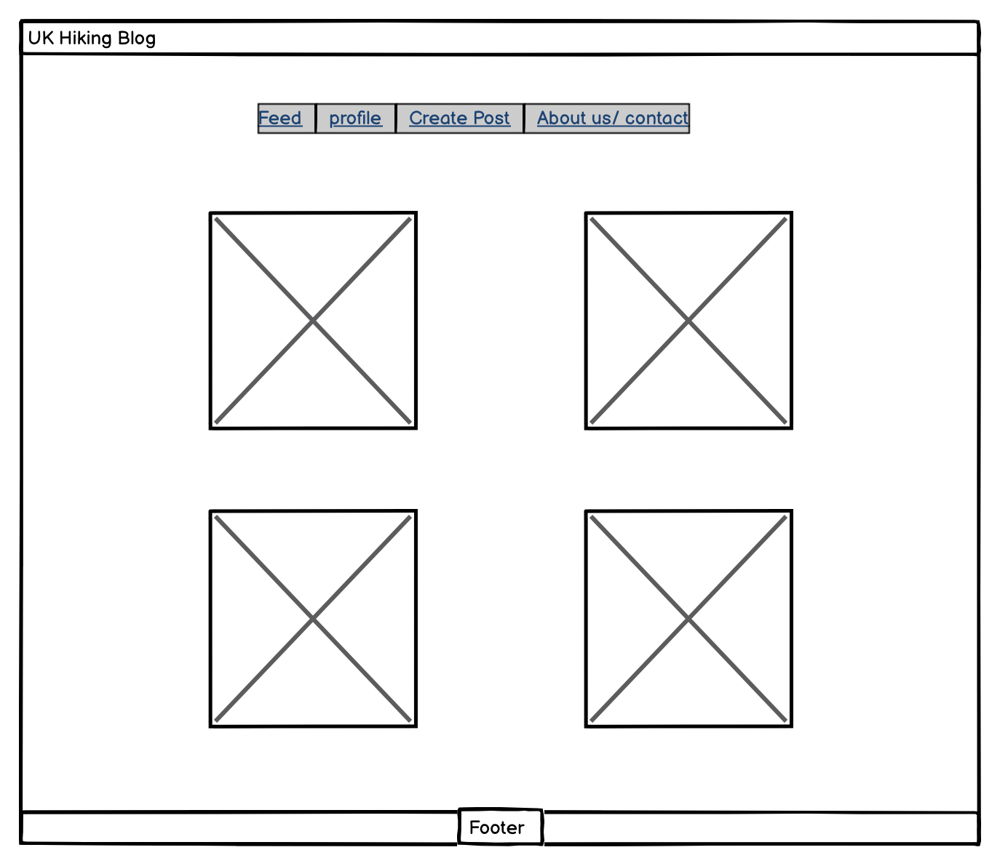
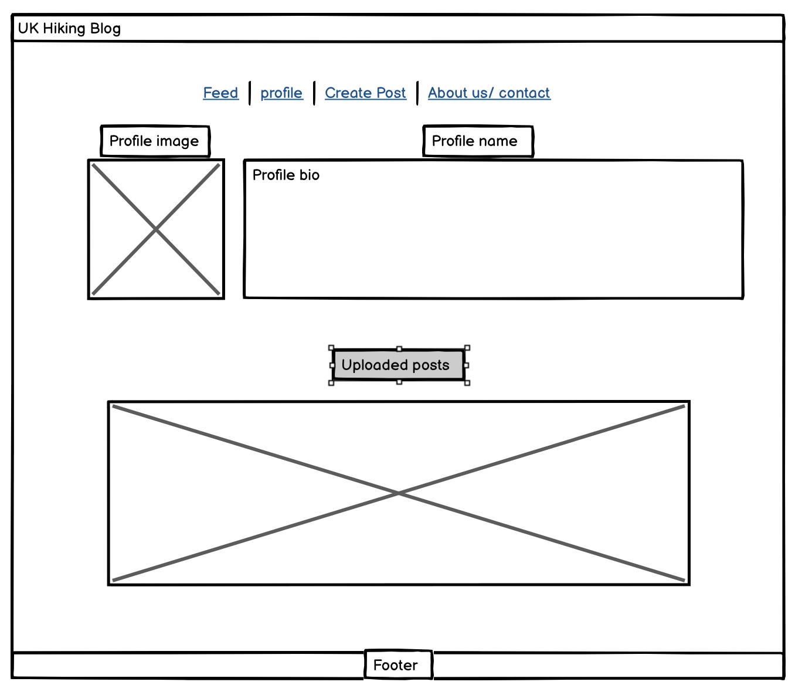
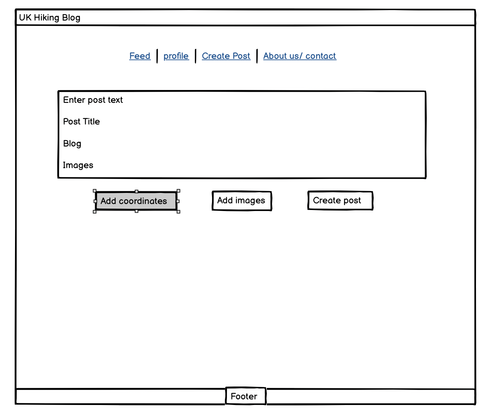

# **UK Hikes - Project Planning**

## **1. Minimum Viable Product (MVP)**
The **UK Hikes** platform will allow users to:
- **Register and log in** to their account.
- **Create and browse hiking posts** with location and difficulty filters.
- **Comment on and upvote posts** to engage with the hiking community.
- **Filter hikes by location and difficulty** to find relevant hikes.
- **Ensure a fully responsive design** for easy navigation on any device.

---

## **2. User Stories**
User stories are categorised into **Epics** for structured development.

### **Epic 1: User Authentication**
- **As a user**, I can register and log in so that I can access the site's features.
- **As a user**, I can update my profile so that I can personalize my experience.

### **Epic 2: Post Management**
- **As a user**, I can create hiking posts with title, content, location, and difficulty.
- **As a user**, I can browse posts by location and difficulty so that I can find hikes that interest me.

### **Epic 3: Community Interaction**
- **As a user**, I can comment on posts so that I can engage in discussions with other hikers.
- **As a user**, I can upvote/downvote posts so that I can highlight helpful content.

### **Epic 4: Post Organization and Filtering**
- **As a user**, I can filter posts by location and difficulty to find hikes that match my needs.

### **Epic 5: Responsive Design**
- **As a user**, I can access the blog on any device so that I can browse hiking content easily.

### **Epic 6: Admin Moderation**
- **As an admin**, I can delete inappropriate posts or comments to maintain a positive community.

### **Future Enhancements (Not MVP)**
- **As a user**, I can use a contact form to send feedback or inquiries to the platform administrators.
- **As an admin**, I can view analytics on post activity to identify popular topics.

---

## **Wireframes**
Below are the planned wireframes for the key pages:

### **Login Screen**
- Allows users to log in to their account.

### **Register New Account Screen**
- Allows new users to create an account.

### **Feed Screen**
- Displays a feed of hiking posts with filters for **location and difficulty**.

### **Profile Page**
- Displays **user information, their posts, and edit profile options**.

### **Create Post Page**
- Allows users to **submit a new hiking post** with title, content, and optional images.

---

## **4. Project Workflow**
- This project follows **Agile methodology** with sprints:
  - **Sprint 1:** User authentication and basic post creation.
  - **Sprint 2:** Comments and upvotes for community interaction.
  - **Sprint 3:** Filtering and categorization of posts.

- All **issues and tasks** will be tracked on **GitHub Issues**.
