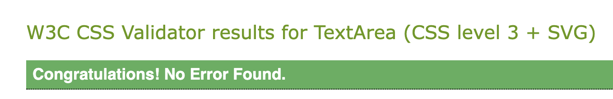

# **UK Hikes - Testing Documentation**

## **Overview**

This document outlines the testing process for the **UK Hikes Django Blog** project. The testing phase ensures that the web application functions correctly, meets its requirements, and provides a smooth user experience.

---

## **1. Types of Tests**

### **Flake8 and PEP8**

- The code was tested using **Flake8** to ensure it adheres to **PEP8** standards. The code passes without errors, ensuring consistent formatting.

---

## Lighthouse Testing Results for Home Page

### Best Practices: 78
- The score might be impacted by image optimisation issues or the use of third-party cookies, as highlighted in the diagnostics.

## Lighthouse Testing Results for Profile Page

## Lighthouse Testing Results for Testimonial Page

---

## CSS Validator 

## **CSS Validator**

The CSS files for the **UK Hikes** project were tested using the [W3C CSS Validator](https://jigsaw.w3.org/css-validator/). The CSS passed the validation without any issues, ensuring that the styling is consistent and adheres to web standards.

---

## HTML Validator

The HTML files of the **UK Hikes** project were tested using the [W3C HTML Validator](https://validator.w3.org/). During the validation, several errors were reported. However, these errors are related to Django template tags.

---

### **JavaScript Validator**

The JavaScript code for this project was tested using **[JSHint](https://jshint.com/)**, and no warnings were detected after enabling ES6 support. The code passes all validation checks, ensuring that modern JavaScript features such as `const`, `let`, arrow functions, and template literals are properly supported and utilised.

---

### **Manual Testing**

## Manual Testing Scenarios

### 1. User Registration

#### Test Case 1: Valid Registration
- **Steps:**
  1. Navigate to the registration page.
  2. Enter a valid email address.
  3. Enter a strong password that meets the security criteria.
  4. Fill out any additional required fields.
  5. Submit the form.
- **Expected Result:**  
  - Registration is successful.
  - A confirmation message is displayed.
  - The user is redirected to the profile page or a welcome page.

#### Test Case 2: Registration with Invalid Email
- **Steps:**
  1. Navigate to the registration page.
  2. Enter an invalid email (e.g., "user@domain", missing a proper domain).
  3. Fill in the other fields with valid data.
  4. Submit the form.
- **Expected Result:**  
  - Registration is rejected.
  - An error message is displayed specifying that the email address is invalid.

#### Test Case 3: Registration with Weak Password
- **Steps:**
  1. Navigate to the registration page.
  2. Enter a valid email address.
  3. Enter a password that does not meet the strength requirements (e.g., "12345").
  4. Submit the form.
- **Expected Result:**  
  - Registration is rejected.
  - An error message is displayed indicating that the password is too weak.

#### Test Case 4: Missing Required Fields
- **Steps:**
  1. Navigate to the registration page.
  2. Leave one or more required fields empty.
  3. Submit the form.
- **Expected Result:**  
  - Registration is prevented.
  - Specific error messages appear next to the missing fields.

---

### 2. Post Creation

#### Test Case 1: Successful Post Creation
- **Steps:**
  1. Log in to the application.
  2. Navigate to the post creation page.
  3. Enter valid text for the title and content.
  4. Upload one or more images.
  5. Submit the post.
- **Expected Result:**  
  - The post is created and displayed on the homepage.
  - A success message is shown.

#### Test Case 2: Incomplete Post Submission
- **Steps:**
  1. Log in to the application.
  2. Navigate to the post creation page.
  3. Leave the title or content field empty.
  4. Attempt to submit the post.
- **Expected Result:**  
  - The submission is rejected.
  - An error message indicates that all fields must be filled out.

#### Test Case 3: Image Upload Failure
- **Steps:**
  1. Log in and go to the post creation page.
  2. Try uploading an unsupported file format (e.g., a .txt file) instead of an image.
- **Expected Result:**  
  - The system prevents the file upload.
  - A clear error message is displayed indicating that only image files are allowed.

---

### 3. Commenting

#### Test Case 1: Valid Comment Submission
- **Steps:**
  1. Log in and navigate to a specific post.
  2. Enter a comment that meets the minimum length requirement.
  3. Submit the comment.
- **Expected Result:**  
  - The comment is successfully added to the post.
  - A confirmation or updated comment list is displayed.

#### Test Case 2: Empty or Short Comment
- **Steps:**
  1. Log in and navigate to a post.
  2. Attempt to submit an empty comment or one that is too short.
- **Expected Result:**  
  - The system prevents the comment submission.
  - A validation error message is shown specifying the minimum length requirement.

---

### 4. Testimonial Submission

#### Test Case 1: Valid Testimonial Submission
- **Steps:**
  1. Log in and navigate to the testimonial submission page.
  2. Enter testimonial content that meets all guidelines.
  3. Submit the testimonial.
- **Expected Result:**  
  - The testimonial is accepted and sent to the admin for approval.
  - A message confirms that the testimonial is pending approval.

#### Test Case 2: Incomplete Testimonial Submission
- **Steps:**
  1. Log in and go to the testimonial submission page.
  2. Leave the testimonial content empty.
  3. Attempt to submit.
- **Expected Result:**  
  - The system rejects the submission.
  - An error message indicates that testimonial content is required.

---

### 5. Log In

#### Test Case 1: Successful Log In
- **Steps:**
  1. Navigate to the log in page.
  2. Enter valid credentials.
  3. Submit the log in form.
- **Expected Result:**  
  - The user is logged in successfully.
  - The system redirects to the home or profile page.

#### Test Case 2: Incorrect Credentials
- **Steps:**
  1. Navigate to the log in page.
  2. Enter an incorrect username or password.
  3. Submit the form.
- **Expected Result:**  
  - The log in attempt fails.
  - An error message is displayed, indicating incorrect credentials.

#### Test Case 3: Missing Log In Information
- **Steps:**
  1. Navigate to the log in page.
  2. Leave one or more fields empty.
  3. Submit the form.
- **Expected Result:**  
  - The log in attempt is prevented.
  - The user is prompted to fill in the missing information.

---

## **User Testing (Family and Friends)**

### **Testing Overview**
In addition to the manual testing conducted during the development of the **UK Hikes** website, I also invited family and friends to test the website. They were tasked with creating their own accounts, uploading images, and posting blog entries and testimonials.

### **Testing Activities**
- **Account Creation**: Testers successfully created user accounts with different username and password combinations.
- **Content Creation**: Testers posted their own blog posts, including text and images, as well as submitting testimonials.
- **Commenting**: Testers submitted comments on existing posts, ensuring that the commenting functionality worked as expected.
- **Feedback**: Each participant provided valuable feedback regarding their experience using the site.

### **Impact of User Feedback**
The feedback collected from these users helped identify areas for improvement, particularly around user navigation, content submission, and commenting. This has been crucial in enhancing the overall user experience, ensuring that the website is intuitive and easy to use.

